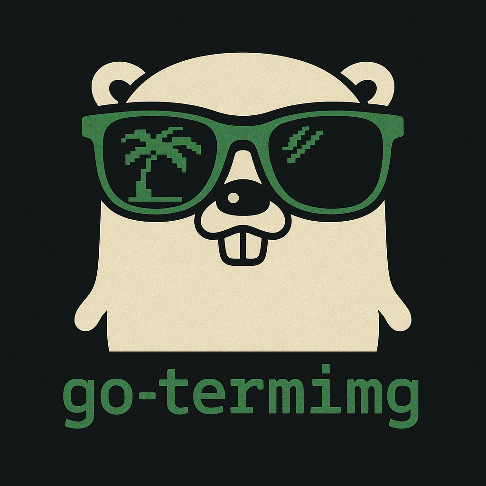

<p align="center">
  <picture>
  <source media="(prefers-color-scheme: dark)" srcset="docs/logo-dark.png" height="400">
  <source media="(prefers-color-scheme: light)" srcset="docs/logo-light.png" height="400">
  
</picture>

  <h4><p align="center">Modern terminal image library for Go</p></h4>
  <p align="center">
    <a href="https://github.com/blacktop/go-termimg/actions" alt="Actions">
          </a>
    <a href="https://pkg.go.dev/github.com/blacktop/go-termimg" alt="Go Reference">
          </a>
    <a href="http://doge.mit-license.org" alt="LICENSE">
          </a>
</p>
</p>

## Features

**Universal Protocol Support**
- 🐱 **Kitty** - Fast graphics with virtual images, z-index, compression
- 🎨 **Sixel** - High-quality with palette optimization and dithering
- 🍎 **iTerm2** - Native inline images with ECH clearing
- 🧱 **Halfblocks** - Unicode fallback (works everywhere)

**Rich Image Processing**
- Smart scaling (fit, fill, stretch, none)
- Advanced dithering (Stucki, Floyd-Steinberg)
- Quality vs speed control
- TUI framework integration (Bubbletea)

**Advanced Features**
- Automatic protocol detection with fallbacks
- Terminal font size detection via CSI queries
- Tmux passthrough support
- Optimized font size caching

> [!WARNING]
> Kitty Unicode placeholder/relative placement features are currently under construction and not recommended for production use.

## Supported Formats

- [x] PNG, JPEG, GIF
- [x] Any format supported by Go's `image` package
- [ ] WebP support planned

## Installation

```bash
go get github.com/blacktop/go-termimg
```

## Getting Started

### Basic Usage

```go
package main

import "github.com/blacktop/go-termimg"

func main() {
    // Simple one-liner
    termimg.PrintFile("image.png")

    // Or with control
    img, _ := termimg.Open("image.png")
    img.Width(50).Height(25).Print()
}
```

### API

```go
// Auto-detect best protocol and render
rendered, err := termimg.Open("image.png").
    Width(80).
    Height(40).
    Scale(termimg.ScaleFit).
    Render()
```

### Protocol-Specific Features

```go
// Kitty with virtual images and z-index (experimental)
termimg.Open("overlay.png").
    Protocol(termimg.Kitty).
    Virtual(true).
    ZIndex(5).
    Print()

// Sixel with dithering
termimg.Open("photo.jpg").
    Protocol(termimg.Sixel).
    Dither(true).
    DitherMode(termimg.DitherStucki).
    Print()
```

### TUI Integration

```go
import tea "github.com/charmbracelet/bubbletea"

type model struct {
    widget *termimg.ImageWidget
}

func (m model) View() string {
    rendered, _ := m.widget.Render()
    return rendered
}

func main() {
    img := termimg.NewImageWidgetFromFile("image.png")
    img.SetSize(50, 25).SetProtocol(termimg.Auto)

    p := tea.NewProgram(model{widget: img})
    p.Run()
}
```

## Command Line Tools

### imgcat - Terminal Image Viewer

Install:
```bash
go install github.com/blacktop/go-termimg/cmd/imgcat@latest
```

Basic usage:
```bash
# Display an image
imgcat image.png

# With specific protocol and size
imgcat -W 100 -H 50 --protocol kitty image.png

# Virtual placement with positioning (Kitty only)
imgcat --virtual --x 10 --y 5 --z-index 3 image.png

# Test terminal capabilities
imgcat --detect

# Show Unicode test grid
imgcat --test-grid
```

Advanced options:
```bash
# Compression and PNG mode (Kitty)
imgcat --compression --png image.png

# Dithering
imgcat --dither photo.jpg

# Scale modes
imgcat --scale fit image.png    # Fit within terminal
imgcat --scale fill image.png   # Fill terminal, crop if needed
imgcat --scale none image.png   # No scaling
```

### gallery - Interactive TUI Demo

Install and run:
```bash
go install github.com/blacktop/go-termimg/cmd/gallery@latest
gallery
```

Interactive features:
- File navigation (↑/↓ or k/j keys, page up/down, home/end)
- Virtual mode toggle (v key - Kitty only)
- Grid view toggle (g key)
- Auto-detection of best terminal protocol

## Protocol Detection

```go
// Auto-detect best available protocol
protocol := termimg.DetectProtocol()

// Check specific protocol support
if termimg.KittySupported() {
    // Use Kitty features
}

// Get detailed terminal features
features := termimg.QueryTerminalFeatures()
fmt.Printf("Font size: %dx%d\n", features.FontWidth, features.FontHeight)
```

## Performance

Performance benchmarks for different protocols:

- **Halfblocks**: ~800µs (fastest, works everywhere)
- **Kitty**: ~2.5ms (efficient, modern terminals)
- **iTerm2**: ~2.5ms (fast, macOS)
- **Sixel**: ~90ms (high quality, slower)

Font size detection is cached to avoid repeated terminal queries.

### Running Examples

The `cmd/` directory contains several example programs:

```bash
# Image viewer
cd cmd/imgcat/
go run main.go ../../test/image.png --id 123 --place --x 5 --y 10

# Interactive gallery
cd cmd/gallery/
go run main.go

# Terminal info
cd cmd/terminfo/
go run main.go
```

## License

MIT Copyright (c) 2024-2025 **blacktop**
